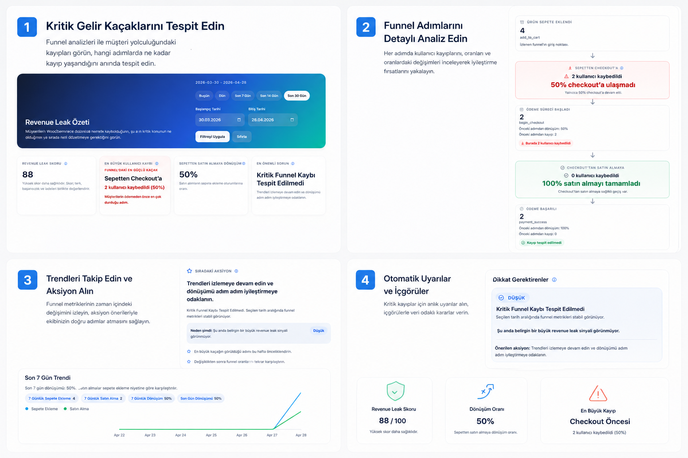

# Revenue Leak Detector

WooCommerce mağazanızda kullanıcıların nerede kaybolduğunu görün, checkout kaçaklarını tespit edin ve dönüşümü artırmak için atmanız gereken bir sonraki adımı öğrenin.

Revenue Leak Detector, kullanıcıların sepete eklemeden checkout’a ve satın almaya giden yolculukta hangi noktada ayrıldığını gösteren hafif bir WooCommerce eklentisidir.

Karmaşık raporlarla uğraşmak yerine doğrudan şunları gösterir:

- en büyük dönüşüm kaybı
- önce ele alınması gereken temel sorun
- atmanız gereken bir sonraki adım

## Özellikler

- WooCommerce ana funnel akışını sepetten satın almaya kadar izler
- Basit bir Revenue Leak Score ile funnel sağlığını puanlar
- En büyük dönüşüm kaybını saniyeler içinde görünür hale getirir
- En acil sorunu otomatik olarak önceliklendirir
- Uygulanabilir bir sonraki adım önerisi sunar
- Son 7 günün dönüşüm trendini hızlıca özetler
- Hazır kısayollarla tarih aralığı filtrelemesi yapmanızı sağlar

## Gereksinimler

- WordPress 6.4+
- WooCommerce
- PHP 7.4+

## Kurulum

1. Eklentiyi `/wp-content/plugins/revenue-leak-detector` dizinine yükleyin
2. WordPress eklenti ekranından etkinleştirin
3. WooCommerce’in aktif olduğundan emin olun
4. Yönetim menüsünden `Revenue Leak Detector` ekranını açın

## Dahil Olan Diller

- İngilizce
- Türkçe
- İspanyolca
- Almanca
- İtalyanca

## WordPress.org

WordPress.org sürümünde ana readme dosyası olarak [`readme.txt`](./readme.txt) kullanılır.

## Geliştirici

Ugur Can Gokkaya  
[https://ugur.me](https://ugur.me)
